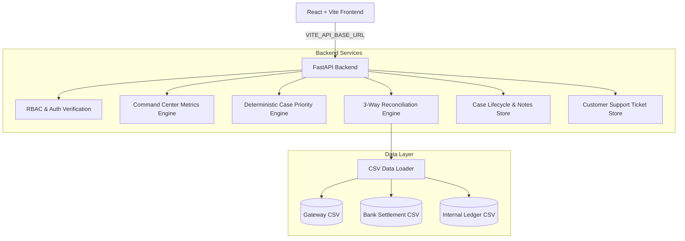

# PayTrace — Automated Settlement Investigation & Operations Command Center

PayTrace is an automated, AI-powered settlement investigation platform built for fintech support and operations teams. It instantly reconciles transactions across payment gateways, bank settlement files, and internal accounting ledgers to detect exceptions, assign deterministic investigation priorities, track case lifecycles, and render an executive-ready Operations Command Center.

> ⚠️ **IMPORTANT DEMO & HACKATHON DISCLAIMER:**
> PayTrace currently uses in-memory state and mock CSV data for hackathon demonstration. Demo user credentials (`customer@paytrace.demo` / `ops@paytrace.demo`) are provided **strictly for testing**. For production deployment, replace mock authentication with an enterprise identity provider (OAuth2 / OIDC / SAML) and replace CSV files/in-memory data with persistent relational databases (PostgreSQL / BigQuery).

---

## Table of Contents
1. [Project Overview](#1-project-overview)
2. [Role-Based Access Model (RBAC)](#2-role-based-access-model-rbac)
3. [Demo Credentials](#3-demo-credentials-demo-only)
4. [Key Features & Capabilities](#4-key-features--capabilities)
5. [Technology Stack](#5-technology-stack)
6. [Architecture & System Flow](#6-architecture--system-flow)
7. [Local Setup Instructions](#7-local-setup-instructions)
8. [Environment Variable Configuration](#8-environment-variable-configuration)
9. [Production Build & Startup Commands](#9-production-build--startup-commands)
10. [Deployment Instructions](#10-deployment-instructions)
    - [Deploying Frontend (Vercel / Netlify)](#a-frontend-deployment-vercel--netlify)
    - [Deploying Backend (Render / Railway)](#b-backend-deployment-render--railway)
11. [Supported Investigation Scenarios](#11-supported-investigation-scenarios)

---

## 1. Project Overview

Investigating delayed, stuck, or mismatched payment transactions typically forces operations analysts to manual cross-reference three separate data silos:
1. **Payment Gateway Logs** (Authorization, charge state, payment method)
2. **Bank Settlement Batches** (Clearing timestamp, bank reference/UTR, fees)
3. **Internal Ledgers** (Posted customer credits, general ledger entries)

PayTrace unifies cross-system reconciliation into a single intelligent workspace. By automatically tracing transaction records across all three sources, PayTrace computes definitive settlement outcomes (`SETTLED`, `SETTLEMENT_EXCEPTION`, `PAYMENT_FAILED`, `INVESTIGATION_UNCERTAIN`), tags root cause exception types, calculates deterministic priority risk scores (`CRITICAL`, `HIGH`, `MEDIUM`, `LOW`), and guides analysts through step-by-step case resolution.

---

## 2. Role-Based Access Model (RBAC)

PayTrace enforces strict access boundaries between customers and internal operations personnel:

### 👤 Customer Role (`CUSTOMER`)
- **Customer Payment Status Portal**: View status, amounts, and progress for assigned transactions (`TXN_1001`, `TXN_1005`, `TXN_1006`).
- **Customer-Friendly Explanations**: Converts complex technical exceptions into clear non-technical progress steps (`Payment`, `Bank Processing`, `Confirmation`).
- **Support Request Flow**: Submit support tickets ("Need Help with this Payment?") directly to operations staff.
- **Strict Data Isolation**: Customers **never** see raw CSV records, internal ledger entries, priority scores, root cause technical codes, rule evaluation traces, or the Operations Command Center (`403 Forbidden`).

### 🛡️ Operations Staff Role (`OPERATIONS_STAFF`)
- **Operations Command Center**: Ecosystem health status, 3-column component breakdown (Gateway, Bank, Ledger), reconciliation velocity bars, and exception landscape distribution.
- **Priority Investigation Queue**: Deterministically prioritized cases requiring immediate analyst focus.
- **Full Dossier & Guided Investigation Workspace**: Step-by-step 6-stage investigation navigation with visual audit timelines and rule evaluation traces.
- **Case Lifecycle Management**: Transition cases through `NEW` → `INVESTIGATING` → `RESOLVED`, add analyst notes, and assign owners.
- **Interactive Smart Demo Mode**: Guided scenario tour simulating key payment exception types for hackathon presentations.
- **Incoming Customer Support Requests Panel**: Investigate customer support tickets directly from the dashboard.

---

## 3. Demo Credentials (DEMO ONLY)

| Role | Email | Password | Allowed Access |
| :--- | :--- | :--- | :--- |
| **Customer** | `customer@paytrace.demo` | `customer123` | My Payments Portal, Support Tickets (Assigned: `TXN_1001`, `TXN_1005`, `TXN_1006`) |
| **Operations Staff** | `ops@paytrace.demo` | `ops123` | Operations Command Center, Priority Queue, All Transactions, Guided Workspace, Case Management |

> 🔑 **Note:** Password verification is handled in-memory for demo simplicity (`backend/main.py`).

---

## 4. Key Features & Capabilities

- 📊 **Operations Command Center:** Executive ecosystem status banner, system health breakdown, reconciliation percentage rate, and exception category distribution.
- 🔥 **Deterministic Case Priority Engine:** Ranks transactions with risk scores (0–100) and actionable priority levels based on financial exposure, SLA breaches, and data conflicts.
- 💳 **Customer Payment Portal & Support Desk:** Friendly 3-stage progress tracking and direct support ticket submission.
- 🗺️ **Guided Investigation Workspace:** Interactive 6-step guided workspace with progress tracking and next-step navigation.
- 📋 **Case Lifecycle Management:** Track case states (`NEW`, `INVESTIGATING`, `RESOLVED`), assign cases to team members, and record persistent notes & audit logs.
- 🛡️ **Zero-Hallucination Rule Tracing:** Rule-based decision tree evaluates gateway, bank, and ledger records deterministically.
- 🎯 **Interactive Smart Demo Mode:** 5 pre-configured scenario walkthroughs with auto-investigation and guided tour banners.

---

## 5. Technology Stack

- **Frontend:** React 19, Vite 8, JavaScript (ES6+), Modern Fintech Dark Mode CSS (CSS Variables)
- **Backend:** Python 3.9+, FastAPI, Uvicorn, Pydantic v2
- **Data Engine:** Standard Library Python (`csv`, `datetime`, `typing`) parsing mock transaction datasets
- **Build & Package Management:** `npm` (Frontend), `pip` / `venv` (Backend)

---

## 6. Architecture & System Flow



---

## 7. Local Setup Instructions

### Prerequisites
- **Node.js** v18.0 or higher
- **Python** v3.9 or higher

### Step 1: Clone Repository
```bash
git clone https://github.com/your-org/PayTrace.git
cd PayTrace
```

### Step 2: Set Up & Start FastAPI Backend
```bash
# Navigate to backend directory
cd backend

# Create virtual environment
python3 -m venv venv

# Activate virtual environment
# On macOS/Linux:
source venv/bin/activate
# On Windows:
# venv\Scripts\activate

# Install dependencies
pip install -r requirements.txt

# Start backend server
uvicorn main:app --reload --host 0.0.0.0 --port 8000
```
- Backend API will run on: `http://localhost:8000`
- API Health Check: `http://localhost:8000/health`
- Interactive OpenAPI Docs: `http://localhost:8000/docs`

### Step 3: Set Up & Start React Frontend
```bash
# Open a new terminal and navigate to frontend directory
cd frontend

# Install dependencies
npm install

# Start development server
npm run dev
```
- Frontend application will run on: `http://localhost:5173`

---

## 8. Environment Variable Configuration

### Frontend Environment Variables (`frontend/.env`)

Copy `frontend/.env.example` to `frontend/.env.local`:
```bash
cd frontend
cp .env.example .env.local
```

| Variable | Description | Default (Local) |
| :--- | :--- | :--- |
| `VITE_API_BASE_URL` | Base URL of the PayTrace FastAPI backend API (without trailing slash) | `http://localhost:8000` |

### Backend Environment Variables (`backend/.env`)

Copy `backend/.env.example` to `backend/.env`:
```bash
cd backend
cp .env.example .env
```

| Variable | Description | Default (Local) |
| :--- | :--- | :--- |
| `PORT` | Port for the Uvicorn web server | `8000` |
| `CORS_ORIGINS` | Comma-separated list of allowed frontend origins for CORS | `*` (or `http://localhost:5173`) |

---

## 9. Production Build & Startup Commands

### Exact Frontend Build Command
```bash
npm --prefix frontend run build
```
Produces optimized static output in `frontend/dist/`.

### Exact Backend Production Start Command
```bash
cd backend && uvicorn main:app --host 0.0.0.0 --port ${PORT:-8000}
```

---

## 10. Deployment Instructions

### A. Frontend Deployment (Vercel / Netlify)

#### Deploying on Vercel
1. Connect your Git repository to **Vercel**.
2. Set Root Directory to `frontend`.
3. Build Command: `npm run build`
4. Output Directory: `dist`
5. Environment Variables:
   - `VITE_API_BASE_URL` = `https://your-paytrace-backend.onrender.com` (Your deployed backend URL)
6. Vercel automatically respects the included `frontend/vercel.json` SPA rewrite configuration.

#### Deploying on Netlify
1. Connect your Git repository to **Netlify**.
2. Set Base directory to `frontend`.
3. Build command: `npm run build`
4. Publish directory: `frontend/dist`
5. Environment Variables:
   - `VITE_API_BASE_URL` = `https://your-paytrace-backend.onrender.com`
6. Netlify automatically respects the included `frontend/netlify.toml` SPA redirect configuration.

---

### B. Backend Deployment (Render / Railway)

#### Deploying on Render
1. Create a new **Web Service** on Render connected to your repository.
2. Build Command: `pip install -r backend/requirements.txt`
3. Start Command: `cd backend && uvicorn main:app --host 0.0.0.0 --port $PORT`
4. Environment Variables:
   - `PYTHON_VERSION` = `3.11.0`
   - `CORS_ORIGINS` = `https://your-paytrace-frontend.vercel.app`
5. Alternatively, deploy using the included root `render.yaml` Blueprint file.

#### Deploying on Railway
1. Create a new project on Railway from your repository.
2. Set Root Directory to `backend` (or use the included `backend/Procfile`).
3. Railway automatically detects Python and reads `backend/Procfile`:
   `web: uvicorn main:app --host 0.0.0.0 --port $PORT`
4. Add environment variable:
   - `CORS_ORIGINS` = `https://your-paytrace-frontend.vercel.app`

---

## 11. Supported Investigation Scenarios

| Transaction ID | Scenario Category | Final Status | Priority | Key Issue / Outcome |
| :--- | :--- | :--- | :--- | :--- |
| `TXN_1001` | Clean Reconciled | `SETTLED` | `LOW` (0) | 3-way match across Gateway, Bank, and Ledger. |
| `TXN_1005` | Missing Ledger | `SETTLEMENT_EXCEPTION` | `HIGH` (75) | Bank settled funds but internal ledger posting failed. |
| `TXN_1006` | Amount Mismatch | `SETTLEMENT_EXCEPTION` | `HIGH` (80) | Gateway authorized ₹10,000 but bank settled ₹9,500. |
| `TXN_1008` | SLA Breach | `SETTLEMENT_EXCEPTION` | `HIGH` (70) | Settlement pending in-flight > 48 hours. |
| `TXN_1009` | Conflicting Records | `INVESTIGATION_UNCERTAIN` | `CRITICAL` (95) | Duplicate conflicting bank settlement rows. |
| `TXN_1010` | Missing Gateway | `INVESTIGATION_UNCERTAIN` | `CRITICAL` (95) | Downstream record exists without primary gateway log. |

---

## 12. Demo Limitations & Production Roadmap

> 📌 **Hackathon & Proof of Concept Note:**

- **Demo Authentication:** Current user authentication utilizes mock credentials (`customer@paytrace.demo` / `ops@paytrace.demo`) with in-memory validation for rapid demonstration. Production deployment requires integration with enterprise identity providers (OAuth2, OpenID Connect, SAML 2.0).
- **In-Memory Storage:** Case status transitions, analyst investigation notes, and customer support tickets are stored in-memory in the FastAPI application process. Production deployment will replace in-memory dictionaries with persistent relational databases (e.g., PostgreSQL / MySQL) and distributed caches (Redis).
- **Extensible Investigation Engine:** The zero-hallucination deterministic investigation engine is decoupled from storage and ready to connect directly to production payment gateway webhooks (Stripe, Razorpay, Adyen), bank settlement file feeds (ISO 20022, BAI2, MT940), and enterprise accounting systems (NetSuite, SAP, internal ledgers).
