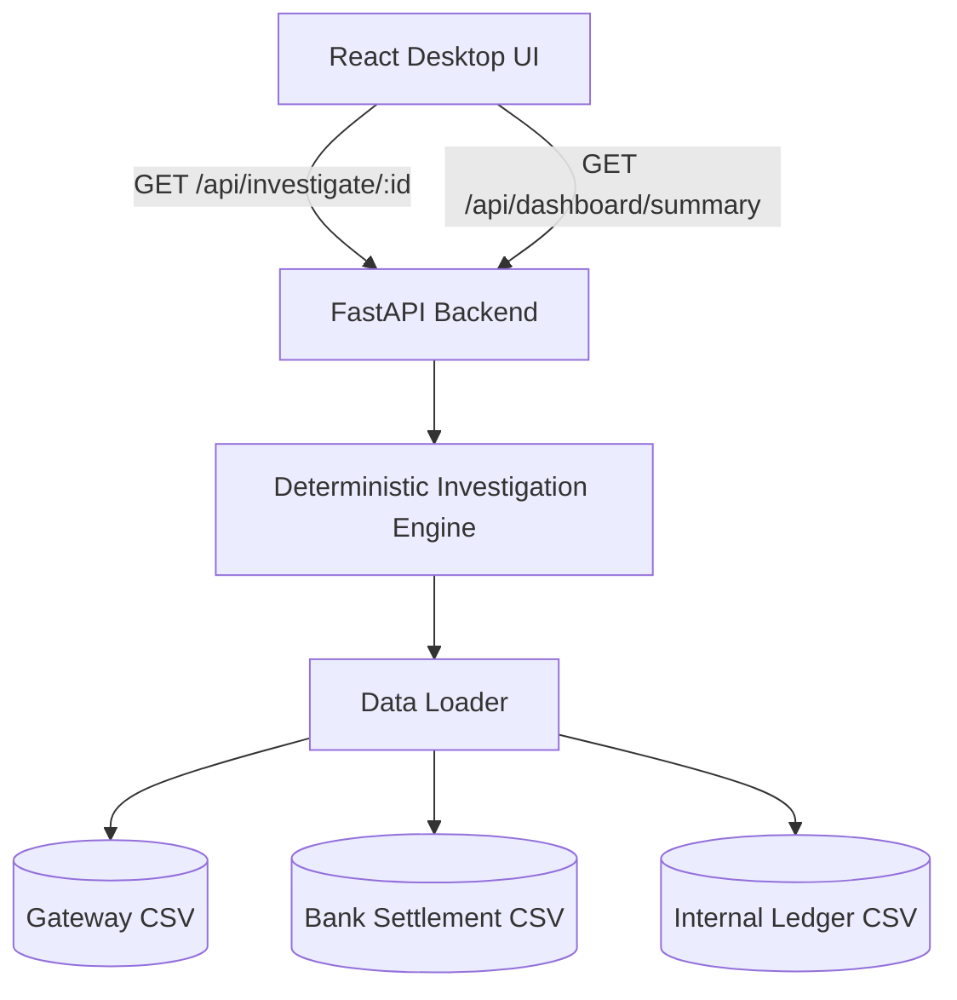

# PayTrace — AI-powered Settlement Investigation & Support Agent

PayTrace is an automated settlement investigation platform designed for fintech support and operations teams. It instantly reconciles transactions across payment gateways, bank settlement files, and internal ledgers to detect exceptions, flag discrepancies, and generate verified resolution guidance.

> ⚠️ **Mock Data Disclaimer:** PayTrace operates strictly on internally generated mock CSV datasets for hackathon demonstration. It does not ingest, store, or process real financial data or live bank files.

---

## 1. Problem Statement

Investigating delayed, stuck, or failed payment settlements traditionally requires support teams to manually search through three separate systems:
1. **Payment Gateway Logs** (Authorization & charge status)
2. **Bank Settlement Batches** (Clearing state, UTR references, & bank fees)
3. **Internal Accounting Ledgers** (Posted credits & customer balances)

This manual cross-referencing is slow, error-prone, and leads to delayed customer resolution times during settlement disputes.

---

## 2. Solution

PayTrace automates cross-system reconciliation into a single desktop investigation interface. By tracing a transaction ID across **Gateway → Bank → Internal Ledger**, PayTrace delivers:
- **Final Settlement Status:** Definitive resolution state (`SETTLED`, `SETTLEMENT_EXCEPTION`, etc.)
- **Confidence Level:** Deterministic confidence score (`HIGH`, `MEDIUM`, `LOW`)
- **Detected Exception Tags:** Instant identification of root causes (`MISSING_LEDGER`, `AMOUNT_MISMATCH`, `SLA_BREACH`, etc.)
- **Recommended Action:** Clear operational next steps for support teams
- **Visual Transaction Timeline:** Step-by-step audit trace with timestamps
- **Verified Investigation Summary:** Plain-language synthesis generated strictly from verified system records

---

## 3. Key Features

- 🔍 **Instant Cross-System Tracing:** Reconciles 3 separate data sources in a single click.
- 🎯 **Deterministic Exception Engine:** Rule-based evaluation eliminates guesswork.
- 📊 **Support Operations Dashboard:** Real-time status breakdown and quick-select transaction cards.
- 🛡️ **Verified Investigation Summary:** Factually grounded narrative with a clear trust indicator.
- ⏱️ **Automatic SLA Tracking:** Flags bank settlements pending past the 48-hour SLA window.
- ⚡ **Zero-Database Setup:** Parses CSV datasets directly via FastAPI for rapid hackathon execution.

---

## 4. How It Works

```text
Transaction ID Input
       │
       ▼
Data Store Lookup (Gateway, Bank, Ledger CSVs)
       │
       ▼
Cross-System Trace & 3-Way Reconciliation
       │
       ▼
Deterministic Engine (Pre-checks, 48h SLA, Exception Tagging)
       │
       ▼
Status & Confidence Classification
       │
       ▼
Verified Narrative Synthesis + Visual Audit Timeline
       │
       ▼
Support Team Action Callout
```

---

## 5. Architecture



---

## 6. Supported Investigation Scenarios

### Core Final Statuses

| Final Status | Description |
| :--- | :--- |
| **`SETTLED`** | Gateway authorized, bank settled, and ledger recorded matching amounts. |
| **`BANK_SETTLEMENT_PENDING`** | Gateway authorized; bank settlement in-flight within standard 48-hour SLA. |
| **`PAYMENT_FAILED`** | Payment failed at the gateway level. |
| **`PAYMENT_PENDING`** | Payment is actively processing at the gateway level. |
| **`SETTLEMENT_EXCEPTION`** | Actionable discrepancy requiring support team intervention. |
| **`INVESTIGATION_UNCERTAIN`** | Data ambiguity, corrupt records, or missing primary gateway log. |

### Exception Tags

- `MISSING_LEDGER`: Bank settled funds, but no internal ledger posting was recorded.
- `AMOUNT_MISMATCH`: Financial discrepancy between Gateway, Bank, or Ledger amounts.
- `BANK_REJECTED`: Gateway payment succeeded, but bank settlement batch was rejected.
- `SLA_BREACH`: Bank settlement has remained pending for over 48 hours.
- `CONFLICTING_RECORDS`: Duplicate or conflicting settlement entries found for a single ID.
- `MISSING_GATEWAY_RECORD`: Downstream bank or ledger record exists without a gateway log.
- `PHANTOM_RECORD_CONFLICT`: Gateway logged a payment failure, but downstream records exist.

---

## 7. Why PayTrace Is Trustworthy

- **Zero Hallucination Guarantee:** The status, exceptions, and recommendations are determined by a deterministic Python engine.
- **Fact-Grounded Summaries:** The UI narrative is built exclusively from verified API response data.
- **Explicit Data Quality Warnings:** Duplicate, missing, or conflicting records are flagged immediately as `INVESTIGATION_UNCERTAIN`.
- **Trust Indicator:** Every investigation summary displays the `🛡️ Based on verified Gateway, Bank and Ledger records` badge.

---

## 8. Tech Stack

- **Frontend:** React, Vite, JavaScript, Custom Modern Fintech CSS
- **Backend:** Python 3, FastAPI, Uvicorn
- **Data Store:** CSV-based mock dataset (Python standard `csv` module)

---

## 9. Project Structure

```
PayTrace/
├── backend/
│   ├── data/
│   │   ├── gateway_transactions.csv
│   │   ├── bank_settlements.csv
│   │   └── internal_ledger.csv
│   ├── data_loader.py       # CSV reading and record bundling
│   ├── investigator.py      # Deterministic rule engine & timeline generator
│   ├── main.py              # FastAPI endpoints & CORS configuration
│   ├── test_backend.py      # Automated engine test suite
│   └── requirements.txt
├── frontend/
│   ├── src/
│   │   ├── App.jsx          # Investigation UI & Support Dashboard
│   │   ├── App.css          # Fintech component styling & layout
│   │   ├── index.css        # Design tokens & color variables
│   │   └── main.jsx
│   ├── index.html
│   ├── package.json
│   └── vite.config.js
├── .gitignore
└── README.md
```

---

## 10. Demo Transactions Matrix

| Transaction ID | Scenario Category | Key Issue / Outcome |
| :--- | :--- | :--- |
| `TXN_1001` | **SETTLED** | Clean 3-way reconciliation (INR 1,500.00). |
| `TXN_1003` | **PAYMENT_FAILED** | Failed at gateway (`INSUFFICIENT_FUNDS`). |
| `TXN_1004` | **PAYMENT_PENDING** | Payment processing at gateway. |
| `TXN_1005` | **SETTLEMENT_EXCEPTION** | Missing ledger entry (`MISSING_LEDGER`). |
| `TXN_1006` | **SETTLEMENT_EXCEPTION** | Gateway INR 10,000 vs Bank INR 9,500 (`AMOUNT_MISMATCH`). |
| `TXN_1007` | **SETTLEMENT_EXCEPTION** | Settlement batch rejected by bank (`BANK_REJECTED`). |
| `TXN_1008` | **SETTLEMENT_EXCEPTION** | Bank settlement pending > 48 hours (`SLA_BREACH`). |
| `TXN_1009` | **INVESTIGATION_UNCERTAIN** | Duplicate bank settlement rows (`CONFLICTING_RECORDS`). |
| `TXN_1010` | **INVESTIGATION_UNCERTAIN** | Orphaned bank settlement (`MISSING_GATEWAY_RECORD`). |
| `TXN_1011` | **PAYMENT_FAILED** | Failed payment with downstream records (`PHANTOM_RECORD_CONFLICT`). |

---

## 11. Running the Project

### Prerequisites
- Python 3.9+
- Node.js 18+

### 1. Start FastAPI Backend
```bash
cd backend
python3 -m venv venv
source venv/bin/activate
pip install -r requirements.txt
uvicorn main:app --reload --port 8000
```
*Backend API Health Check:* `http://localhost:8000/health`

### 2. Start React Frontend
```bash
cd frontend
npm install
npm run dev
```
*Frontend Web App:* `http://localhost:5173`
